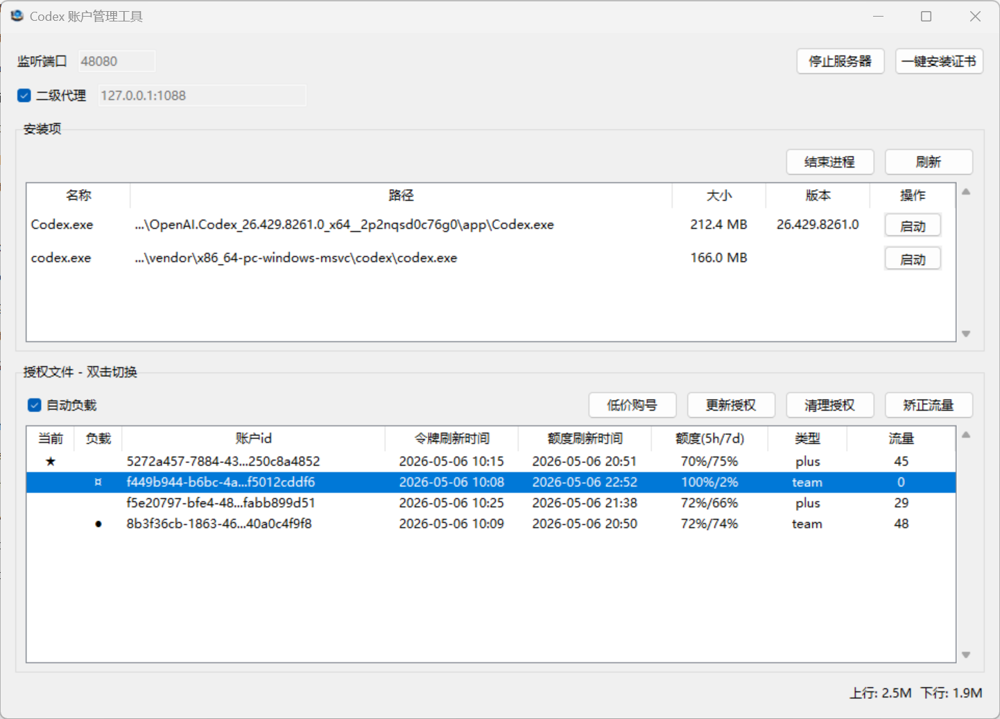

# Codex Session Manager

Codex Session Manager 是一个面向 Windows 的 Codex 账户管理工具，核心能力是通过本地代理自动接管 Codex 请求，在多份 Codex 授权之间自动选择更合适的 session 使用。

它的重点不是手动复制 token，而是让 Codex 客户端继续按原方式运行，由代理层根据当前账户额度自动改写请求中的 `Bearer accessToken`，实现多账号无感切换和自动负载。

## 核心能力

- 自动同步 `~/.codex/auth.json` 到本地 `auth/` 管理目录。
- 自动读取每个授权的账号 ID、计划类型、额度、额度刷新时间和访问令牌。
- 默认开启自动负载，优先选择 5 小时剩余额度更高的 Codex session。
- 代理层会对请求头中的 `Bearer accessToken` 做统一替换，不绑定单一接口 URL。
- 自动统计被实际使用的 token 流量，并在授权表中展示。
- 代理空闲超过 5 秒时重新选举负载目标。
- 检测到旧长连接仍在消耗非目标 token 时，会等待 WebSocket ping/pong 时机断开旧连接。
- UI 中用“当前”和“负载”两列区分源授权文件和自动负载目标。

## 界面预览



界面上方用于管理本地代理和启动已安装的 Codex 程序；下方授权表集中展示 Codex session 的当前授权、自动负载目标、额度刷新时间、额度类型和实际流量。保持“自动负载”开启后，程序会根据额度自动选择“负载”列标记的 session。

## 自动负载的工作方式

程序启动后会创建一个本地 mitmproxy 代理，并启动一个内部控制通道。Codex 进程通过该代理访问网络时，代理插件会把请求中的 `Bearer accessToken` 替换为当前自动负载选中的 access token。

自动负载目标由 UI 侧维护：

1. `AuthSyncService` 持续监听 `~/.codex/auth.json`，把授权同步到 `auth/` 目录。
2. `AuthUsageService` 定时请求 ChatGPT usage 接口，刷新每个授权的额度、计划类型和额度重置时间。
3. `ProxyWindow` 根据授权表中未禁用账号的额度计算优先级。
4. 选择 5 小时剩余额度百分比最高的授权作为“负载”目标。
5. `ProxyLoggerAddon` 在每个代理请求进入时获取目标 access token，并改写请求头。

因此，“当前”授权表示 `~/.codex/auth.json` 当前指向哪一份授权；“负载”授权表示代理实际优先让 Codex 消耗哪一个 session。自动负载开启时，这两者可以不是同一个账号。

## UI 标记说明

授权表主要字段：

- `当前`：当前写入 `~/.codex/auth.json` 的授权。
- `负载`：自动负载选中的授权，Codex 请求会优先使用它的 access token。
- `账户id`：授权对应的 Codex 账户。
- `令牌刷新时间`：授权文件中的 token 刷新时间。
- `额度刷新时间`：usage 接口返回的 5 小时窗口 reset 时间。
- `额度(5h/7d)`：usage 接口返回的 5 小时和 7 天额度摘要。
- `类型`：账号计划类型。
- `流量`：该 token 被代理实际使用的次数。

右键授权行可以切换、禁用或删除授权。禁用后的授权不会参与自动负载选举。

## 使用流程

1. 以管理员身份启动程序。
2. 程序会启动本地代理，并自动检查或安装 mitmproxy 证书。
3. 在“安装项”中选择 Codex 可执行程序并点击启动。
4. 启动脚本会给 Codex 设置 `HTTP_PROXY`、`HTTPS_PROXY` 和 `ALL_PROXY`，让 Codex 请求经过本地代理。
5. 保持“自动负载”开启，程序会自动选择额度更充足的 Codex session。
6. 需要手动切换源授权时，双击授权行或右键选择“切换”。

## 长连接与流量矫正

Codex 可能存在 WebSocket 或其他长连接。目标 token 切换后，旧连接不一定会立刻断开。程序会做两类处理：

- 当代理超过 5 秒没有数据输出时，触发一次负载目标重新选举。
- 当检测到实际消耗 token 和当前负载目标不一致时，等待下一次 WebSocket ping/pong，再断开旧连接。

如果需要主动处理旧连接，可以点击“矫正流量”。程序会先刷新额度，再请求代理断开当前跟踪到的长连接。

## 配置与数据

- `config.json`：保存监听端口、二级代理和自动负载开关。
- `auth/`：保存从 `~/.codex/auth.json` 同步来的授权镜像。
- `.mitmproxy/`：保存 mitmproxy 证书文件。
- `logs/`：保存运行日志。

自动负载默认开启。如果关闭自动负载，代理会保留原始 token 的计数逻辑，不再主动替换为选举目标。

## 构建发布

仓库包含 GitHub Actions 工作流，可在 GitHub 页面手动触发 Windows 构建。触发后会使用 GitHub Windows 主机打包程序，并按北京时间生成形如 `202605061739` 的 tag 发布 zip 包。

本地打包复用现有 `setup.py`：

```bat
python setup.py build
```

构建产物包含 `codex_session.exe`、`mitmdump.exe`、代理插件、图标和运行所需依赖。
